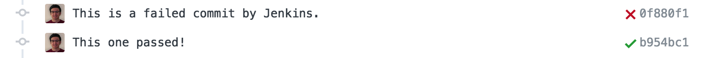

## Introduction
During this past week, I got more in-depth experience using Jenkins on one of the Angular projects I am working on. I've had a little experience playing with Jenkins in the past, but never seriously used it for a project.

## Jenkins
Jenkins is an open source automation server that provides Continuous Integration/Delivery for a given project. With use of GitHub plugins, it can make your development really easy, accurate, and with less error. 

### Project Uses
With the project I'm working, Jenkins has integrated unit testing, as well as linting. This means that whenever a pull request is made toward master, Jenkins will test the latest commit for either testing errors or linting errors. 

Heres an image of a commit failing and another commit passing a Jenkins job stream:

On the first commit, I intentionally left linting errors, as well as some code that broke unit tests. As a result, Jenkins failed the commit and the pull request was automatically closed.

## Other Thoughts
I know Jenkins has a ton of other features as well as plugins that make development much faster and easier on any major source control platform available. I will definitely continue to use Jenkins or other CI/CD tools available for other projects as it makes things so much easier to manage and figure out exactly if my code is working.

(what not to do)

