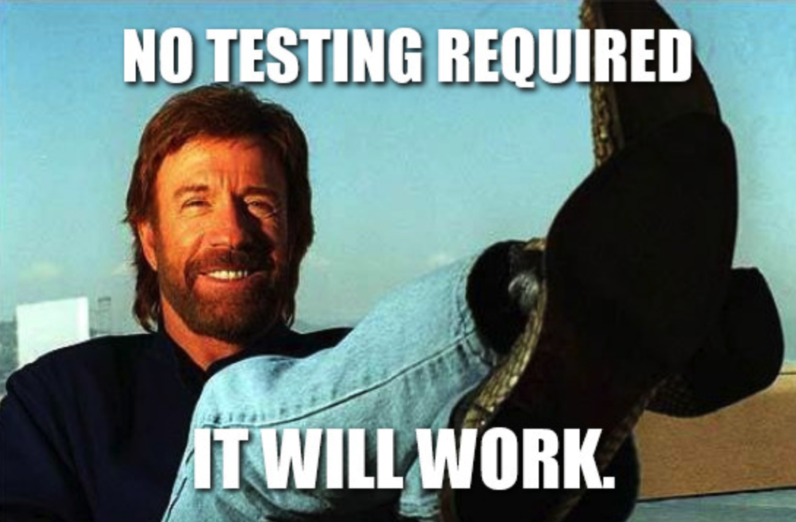
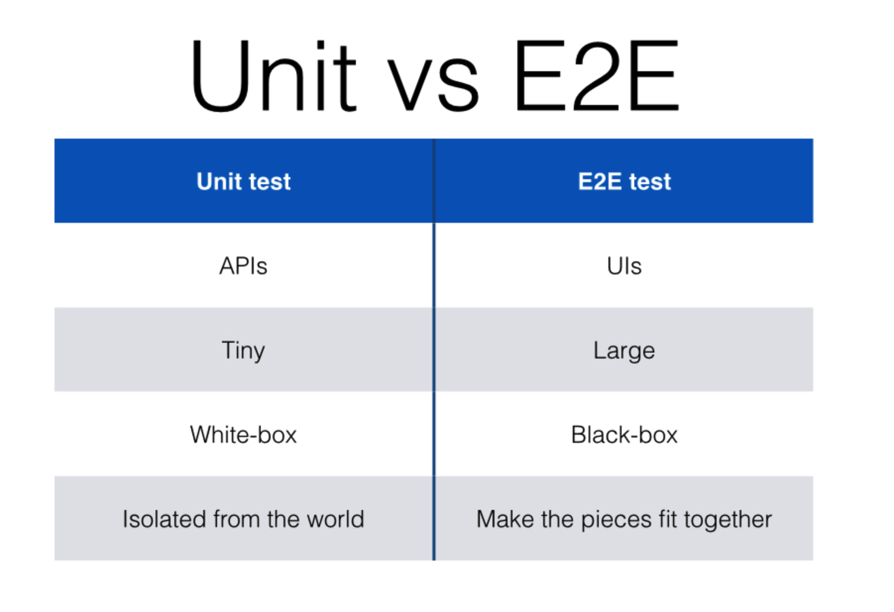
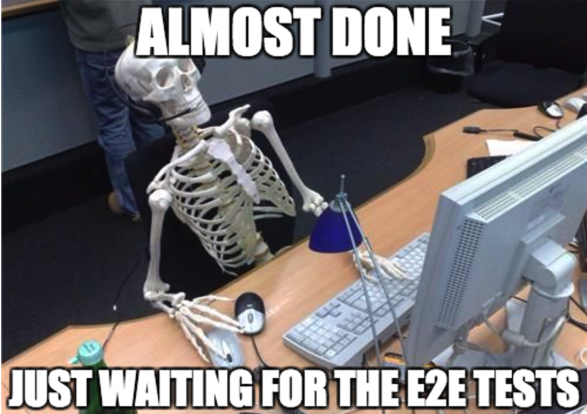

## Back to Testing
For the past couple weeks, I have been working with Nightwatch.js again creating end to end tests for an Angular application on Sharepoint. I noticed that in my previous writings I explained what Nightwatch.js was, and how I used it. I even explained different methods I organized my tests, but it occurred to me that I never really wrote about the importance of testing itself. This week I wanted to go ahead and explain the importance of end-to-end (e2e) testing in my opinion along with my personal experiences. 

(just kidding, it wont)

## End-to-end (e2e) Tests

### What are they?
Basically, e2e tests are tests that that check different dependencies of an application and how they interact with each other. So, for example an e2e test will check and verify whether or not a backend is supplying the correct information to the frontend and that the frontend is displaying this information appropriately and correctly. Since applications may have different functions, tests must be made for each individual function. e2e tests will validate whether or not a particular function works as expected with given input and output across the whole stack.

### How are they useful?
When these e2e tests are ran regularly, it can quickly raise awareness to bugs or issues with an application stack quickly and effectively. Especially when these tests are supplied with continuous integration systems, like Jenkins, it can create a more stable and accurate product. As a result of this, you can save tons of time and money developing an application, which makes both the client and developer happy. 

### How to Create Them
When designing e2e tests, I typically think of common scenarios, and typical workflow of the application. In other words, how would a user use the application, and what are some common things they would do with it. So, for instance, a scenario would be logging into the application then updating their profile. This could be an e2e test that verifies logging in, as well as updating their profile. 

### How do they differ from unit tests?
Although I won’t get too much into it, the main difference between e2e tests and unit tests is that unit tests are focused heavily on a certain feature, whereas e2e tests test multiple features given a particular scenario. They are both good testing strategies, and should both be integrated with a project. 

Heres a table I found online that shows the difference, at their basic level.

## My Personal Experience
So far working with Nightwatch.js to create automated e2e tests has been a pretty good experience, but I do occasionally have difficulties. The main issue I have when developing these tests is that I have the habit of not fully thinking through a test and how it should interact with many other e2e tests. So as a result, I have some redundancy within my tests, when it could have been avoided if I simply thought more through designing a particular e2e testing package.

## Other Thoughts
I think e2e tests are great, but I feel like unit tests should be prioritized more. These unit tests can verify functionality for individual parts of the application and be executed very quickly compared to e2e tests. When you create an e2e test, and run the whole package suite, then it is going to rely on the whole project being built, deployed, and finally tested. This can take a significant amount of time over unit testing.

