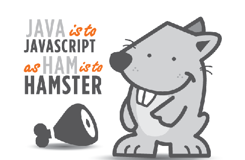

## Jumping Straight In
I've always heard that JavaScript was a great language to learn
Although I have some experience with JavaScript in Web Development (very, very limited), I was finally thoroughly introduced to Basic JavaScript from [Free Code Camp](https://www.freecodecamp.com/). I did the 105 Basic JavaScript exercises and while most was trivial programming stuff like if statements and for loops, but there was a few things I thought were valuable such as the introduction to the standard built-in objects. Free Code Camp was really helpful, and I would totally recommend it to someone who is interested in JavaScript or programming in general. In general I think this language is good for athletic software engineering in the sense that it is easy to pick up and write some quick code. These athletic software engineering exercises are useful because it is common for computer science jobs nowadays to test your knowledge by having you write some quick code. 

## The Language Itself 
Typically, when I jump into a new language I judge it by 2 things: 1. How many lines of code it takes to write "Hello World" and 2. how long it takes to compile and run, which in fact, is most important to me! Compiling also includes having to download any dependencies. Hopping onto [JSFiddle](https://jsfiddle.net/), I simply put a one liner: `console.log("Hello World");`, slapped the F12 key to open an in-browser console, then pressed Run, and voilà! JavaScript passed both of my "tests", and did so with flying colors! I do realize that many languages have their pros and cons, but at the end of the day, I really want to see what the language can offer me. I do not want to hassle with Googling how to compile a program that prints out "am I working yet" to a console.  

### In Comparison to Other Languages
Another thing I typically do is compare a language to another language. For example, I compare C# syntax and style to a combination of C++ and Java. Oddly enough, for JavaScript I like to compare this language to a combination of Python and, you guessed it, Java. The reason why I compare it to Python is because of the shear simplicity of the language (in terms of syntax and basic functionality). A common characteristic that Python and JavaScript have is the "Hello World" one liner. In Python, it is: `print "Hello World"`, and in JavaScript, `console.log("Hello World")`, as I mentioned earlier. Another cool characteristic I found with JavaScript that is the similar to Python is that function parameters do not have any variable types. In JavaScript you type `function Sum(argumentOne, argumentTwo)`, and in Python it would be `def Sum(argumentOne, argumentTwo)`. Personally, I like this because it allows for less mistakes to be made when youre trying to write a quick, small program. Even though there is absolutely no correlation from Java to JavaScript, which is pretty weird considering the name, I still compare JavaScript to Java because of the style and syntax of the language. While doing the exercises on Free Code Camp, I noticed that much of the pre written snippets of code looked very familiar, I thought a little bit deeper and realized "Oh! this looks like Java!" 




### Cool Things I Noticed
While writing some JavaScript I noticed I forgot a semicolon at the end of the line, and the weird part is that I realized this after I successfully ran it. Digging a little bit deeper I found that semicolons are semi optional. For example, you do not have to write a semicolon at the end of the line if the line breaks:

```
var i // Semicolon optional
i++   // Semicolon optional
var j; j++ // first statement required, 
           // second not required since the line breaks
```

I think this is really cool, because again, it allows for less mistakes when you are trying to write a quick program to do something. 

Another thing I found interesting is that there is a single variable type you can use to create variables, which is called "var". Although, my professor in my Software Engineering class has told us to simply use "let" and "const" for our variables, I still think its a cool concept to have a single variable type for everything.  


## My Overall Consensus
I really like JavaScript currently, and I can totally see it applicable to a few personal projects I have in mind. I really like how the language is native to the web browser and can easily be picked up to accomplish a quick task. I also appreciate the standard built-in objects that the language offers, it allows for the programmer to tailor the language to how they see fit. I think that JavaScript would be a good language for someone totally new to programmming to pick up. It allows the person to quickly grasp the concept of programming without being punished harshly by syntax.  
