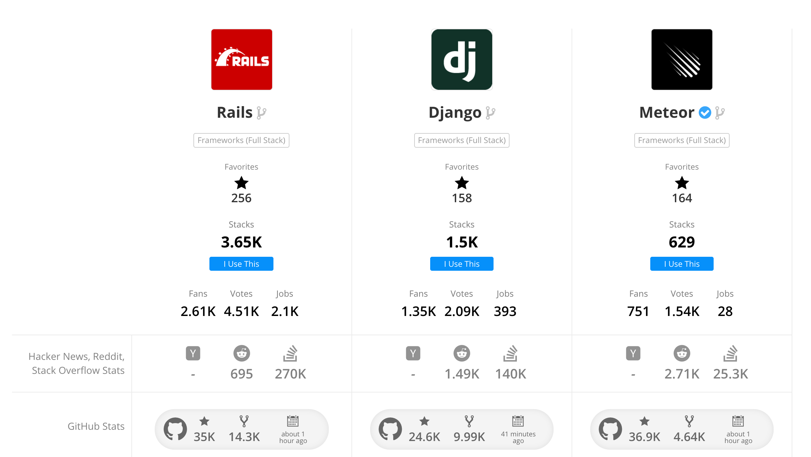

## Introduction
I have heard great things about web frameworks such as Django, Ruby on Rails and even Meteor, but I have never actually gotten around to try and learn one. In my Software Engineering class, we were required to take a look at a few meteor templates, build a few HTML pages with corresponding JavaScript code, read and write to and from a database, and even build a whole web app that introduces a good amount that Meteor can accomplish. It is pretty awesome, but there is one major thing that frustrates alot of people ... the learning curve.

## What is it?
Meteor is an open source framework for web, mobile and desktop platforms. It connects with the Node Package Manager (npm) to allow for modules and extra features to easily be imported into a project (pretty awesome). MongoDB is also commonly used with Meteor to allow for data storage and retrieval. If you know what you are doing then you can rapidly create something that is beautiful and has tons of functionality. 

## The Downsides
There are a few downsides to using Meteor that have ultimately become a dealbreaker for me in the sense that I will not continue to use it (at least for a few years). 

### Speed
The first one is how long it takes to start up a meteor application. I find myself sitting and staring into space while the meteor application is trying to start up. It takes even longer the first time you run it because you have to `meteor npm install` all the node modules pertaining to the application and then you have to `meteor npm run start` the application and wait until it shows up on http://localhost:3000/. Although this may not be an issue for some people, to me it is an annoyance to have to wait for everything to start up just a very simple and basic web application (can you imagine if it was a massive project?).

### Compatibility
Although this may be an issue with many development frameworks, this is still a downside to Meteor. When running meteor on a windows machine, many problems tend to rise and solutions to many of these problems are quite literally "Install Linux or buy a Macbook." 

### Most importantly, Community Support
This was the absolute dealbreaker for me with Meteor. Since Meteor is still fairly new and it is continuously growing rapidly, many modules and ways-of-doing-things are deprecated. I noticed this issue when I participated in the 2017 AT&T Hackathon not too long ago. My team and I decided to build a web app in Meteor when none of us had much experience with it. We sat there and googled many of the issues we were having and to my surprise many of the solutions were deprecated. I asked myself "I thought Meteor was super popular? Why cant I find solutions to these seemingly simple problems?". It wasn't until after the Hackathon I found out how little community support there is currently. 

Here is an image comparing other popular frameworks with Meteor:

The main thing I noticed about these comparisons was the amount of stackoverflow questions. I feel like this is a good indicator of how much support there is by the community so you can find a solution to a problem quickly and easily. You can see that there are only 25.3K for Meteor and 270K for Ruby on Rails. There are more than 10x questions for Rails than there is for Meteor. But, on the contrary, there is alot of activity on the Meteor GitHub Repository, which is a good indicator of how it is growing. 

## Overall
Meteor has a massive learning curve, but it is really cool because it allows for quick development of beautiful and functional web apps, but if you run into any issues then its really hard to find solutions quickly. I feel like in a few years Meteor will be very big and support by the community will be there, and only then I will probably have another go with Meteor. 

