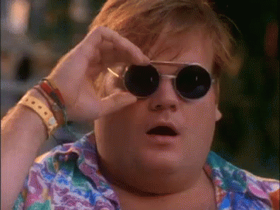

## Introduction
I've worked with browser automation before, including creating a tool using python and selenium to purchase products that would normally sell out in 15 seconds or less. I've also done browser automated testing before using Nightwatch.js, but didn't really pay attention to how I was doing it. 

## What is Nightwatch?
Nightwatch is a Node.js based browser automated testing solution typically used to test the frontend of web applications. It has an API that can easily use css or Xpath selectors to conduct tests. Since Nightwatch runs Selenium, you can use selenium based commands as well. 

## Nightwatch At Work
Typically, when I've used nightwatch in the past, I simply just write a quick script to test a particular feature without take into consideration other tests in the future. As a result, there’s a lot of repetition among testing. For example, If I want to test login, then I'd write a login test. If I wanted to test a feature on the home page, but requires login, I would write a test to login then test the feature on the home page. This week, I noticed I was wasting a lot of time trying to write repetitive tests, and I was violating the concept of DRY (Don’t Repeat Yourself). 

### Solution
I did a little bit of research on how to properly conduct frontend testing, and one of the popular techniques was to use something called Page Objects.

### What are they?
Page objects are essentially another layer of abstraction for testing that split up elements by page. This is great, for example, because you can create a page object and command to login to your web application and then use this command over and over for different tests that may require a user to login. 

## Problems faced
One of the main problems I am facing is trying to split a page object into multiple sections. One of the pages that I am testing has a form that has 2 parts to it that are seperated by a "Next" button. I followed exactly how the documentation says to [create sections](http://nightwatchjs.org/guide#defining-sections), but when I create the test, the elements tied to the css selectors on the page object dont seem to work. Unfortunately, the nightwatch community is not really as big as it should be, so finding solutions to problems like this can be difficult. As a work around, I decided to split the form into 2 different page objects. This might actually work better in the end because there are intermediary actions that can occur between the pages, so it might be good to have the ability to easily test those issues that may occur.

