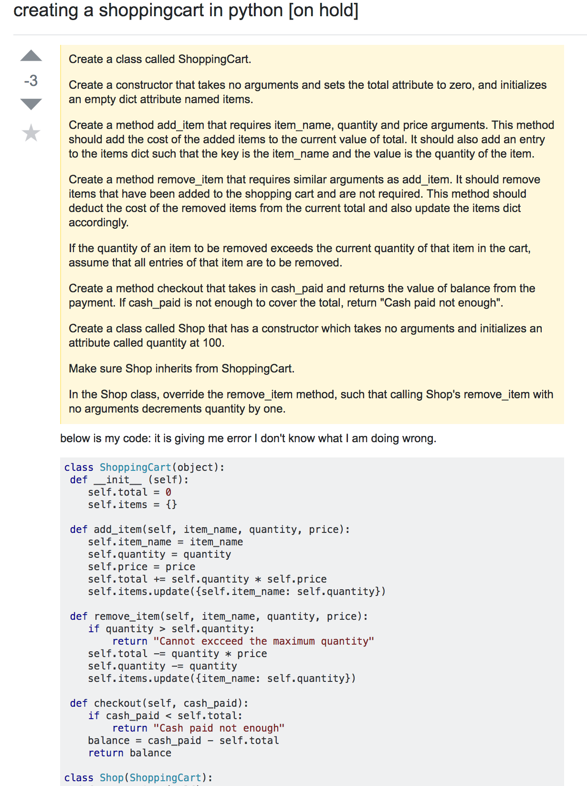

I am sure we have all faced a brick wall while working on a programming project and opened up a browser go to google and frantically type *HOW TO FIX X* and found EXACTLY what we were looking for on StackOverflow. But on the contrary, some of us have had those moments where we were *REALLY* stuck and either had to a) ask a friend or b) ask a stranger on StackOverflow.

Being honest, have you *actually* put effort into how you ask, or even what you ask a question about? The answer is probably no, but you probably should. 

Not only do you help yourself when you make *smart* questions, you also help a community of software engineers. When you ask smart questions, you allow other software engineers to reinforce their own knowledge, and sometimes learn more about a particular topic.

According to an article called "How To Ask Questions The Smart Way" by Eric Steven Raymond, he establishes principles on how you should go about asking question the *right* way.

## What you should NOT do
While browsing for the worst possible StackOverflow question I could find, I eventually found this. The original poster creates the post with a title "creating a shoppingcart in python." The first thing that comes to mind is "this sounds like something a teacher/professor would ask a student to accomplish." With that impression, I knew that his question was going to be really bad, and it was.

### The post itself:

After reading Raymond's principles and comparing it to this, I can easily see that the original poster violated many of Raymond's set principles. It seems like the poster gave the assignment a shot, ran it once and then errored out so he went straight to StackOverflow to ask the community to complete it for him/her. The poster quite literally posted the assignment instructions, his code, and proceeds to say "Below is my code: it is giving me error I don't know what I am doing wrong." This comes off as the poster being lazy and not doing any research at all for his problem. This image doesnt show the full posting, but someone commented "You could at least tell us what the error is... please put effort into your questions." Just like Raymond pointed out, these *bad* questions not only waste your time, it wastes everyones time.

## What you SHOULD do
Again, while browsing for the best possible StackOverflow question I could find, I found this. The original poster clearly made the title straight to the point with sufficient information needed to attract the right help.

Here is a picture of the original posting: 

What makes this a good post is most definitely the title and the description. The poster clearly posts their version of Django that they are using, writes exactly what they have an error with in great description, and formats the description very clearly and easy to read. Not only did they have a great posting, they updated their posting to include more information so incoming answers wouldnt be repeated. This post was so helpful to not only himself, but it was helpful to the community as well. Many people contributed to the post, which means it engaged many software engineers themselves.
