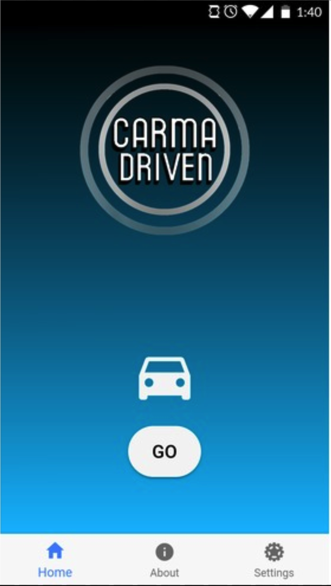
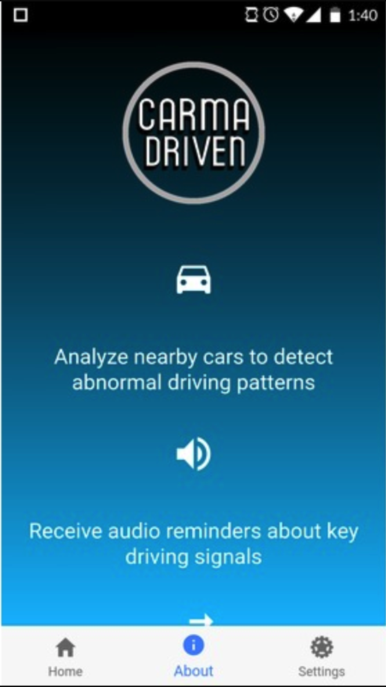
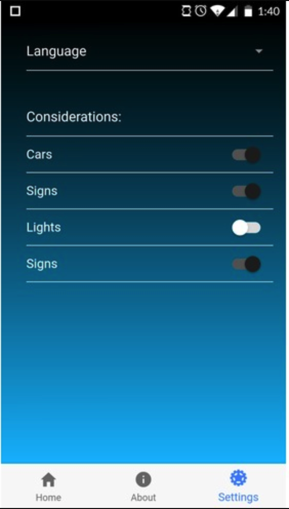

## Introduction
A friend and I applied to Dubhacks 2017, got accepted and received travel reimbursement to participate. At Dubhacks we joined a team of 3 other people who were from 2 other Universities and were new to Hackathons. I mainly spent my time during this hackathon helping and mentoring my teammates on how to develop TypeScript based web frameworks such as Ionic, as well as the fundamentals to ajax requests. 

## What is Dubhacks
Dubhacks is the largest hackathon in the pacific northwest hosted by the University of Washington. The hackathon is sponsored by a ton of companies including: Facebook, Google, Microsoft, and Amazon. There are 3 primary challenges that are offered to the competitors, and the sponsors have their own smaller challenges that as well. During the hackathon itself they offered meals, snacks, energy drinks, and even activities to all the competitors. This year was the largest turnout with over 700 competitors as well as over 100 teams. 

## The Idea
We wanted to take on Challenge 1, which stated: 

Reimagine a tool of today to cultivate equity and access for everyone tomorrow.

We decided to create an app that could not only help the general population, but help the visually impaired greatly. Our idea was to create an app that could be placed on a dashboard of a vehicle, and would use machine learning to tell a user whether or not there are stop signs, traffic lights, or even pedestrians that you would need to be extra aware of. We also allowed real-time geolocation data to access historic location data about traffic, and accidents to allow a user to be aware of this while they drive. A text to speech voice would then speak to the user while they drive to get important information that they need to be aware about.

## The Techstack
Our techstack was:

- Ionic 
- Microsoft Cognitive Custom Vision AI API
- Shine API 
- a little bit of tears

We decided to use Ionic because it included all the features we needed, Camera, Geolocation, and an easy to use css framework. The Custom Vision AI API was perfect because it allowed us to use specific training data to create models to look for. It looked for traffic lights, stop signs, and even pedestrians. We used Liberty Mutual's Shine API, for historic location data.
And of course, a little bit of tears to let out some stress.

### The Development
During this Hackathon, I contributed to more software design than I did coding, although I felt like I still did a lot of coding. Since we had 3 other people on our team that were completely new to the frameworks that we were using, I had to design the project development in a way that was intuitive and easy to pick up. I assigned tasks and regularly checked up on everyone’s progress to make sure they weren't stuck and I could give them the help they needed.

### The Result
We finished up with a prototype that was working as intended even though we had some bugs (but that’s pretty inevitable with a project made in 24 hours). With a hackathon at this size it was kind of a challenge to have all projects presented and judged in a short amount of time. Everyone had their own designated spot in a room and all the challenges that you signed up to compete for would come and judge your project. If you signed up for a main challenge then they would pick the top 2 projects for that particular challenge and have them create a final presentation for all 700 participants and final judges.

Our project did surprisingly well compared to the other 48 teams that signed up for our particular challenge, and we were able to do a final presentation. We did our presentation, but unfortunately, we didn't win (but that's okay!). 

  

    

        
    

    

        
    

  

  

    

        
    

    

        
    

  

