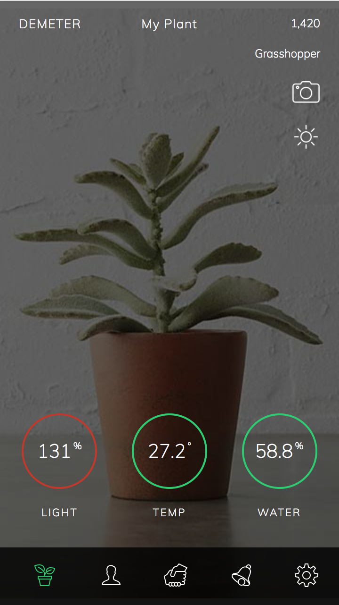
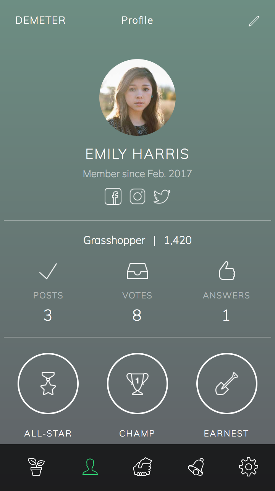
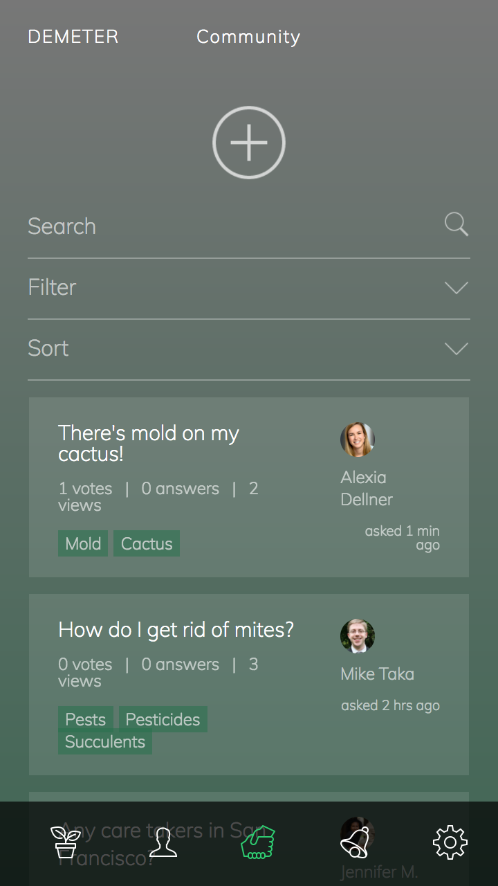

## Summary
Created a gamified plant monitoring system equipped with a Raspberry Pi along with light, temperature, and humidity sensors.

Features included:
* Color coordinated plant health status
* Profile with achievements
* Community similar to StackOverflow, but for plants 

## How We Built it
We created this application with Meteor, and used a Raspberry Pi to post data to AT&T M2X Database aimed for use on IoT devices.

## Personal Responsibilities
Personal responsibilities to this project included:
* Set up the sensors on the Raspberry Pi.
* Create the Python script to gather and send humidity, temperature, and light data from the Raspberry Pi to the M2X database.
* Set up the Meteor application to gather the resulting data from the M2X API and display results.
* Assist with connecting the front-end UI with the Meteor web application.

## The App Itself

  
  
  

