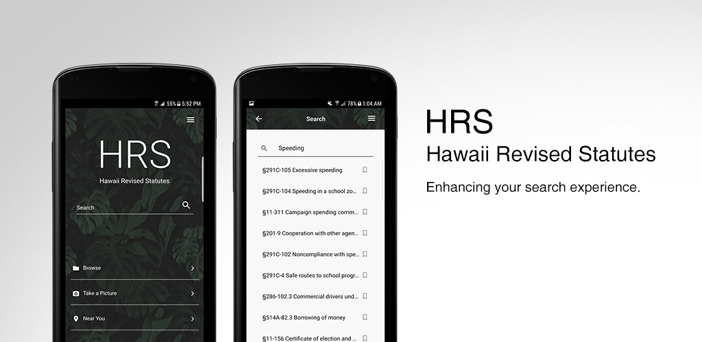

## Summary
Developed a powerful retrieval system for Hawaii’s laws built upon the latest human computer interaction principles and mobile design patterns. An app elegantly designed and engineered to enhance your exploration through thousands of laws waiting to be discovered. Developed for the 2017 Hawaii Annual Code Challenge and won 2nd place out of 29 teams.

Features included:
* MongoDB database
* An organized RESTful API 
* Streamlined, user-friendly interface.
* Search Engine equippped with ElasticSearch
* Optical Character Recognition (OCR) system to allow a user to take a picture of a physical sign and receive the relevant statute.
* Statute locations near the user for extra awareness.

## How We Built it
We created the application using the MEAN stack technologies along with Ionic.

Specific technologies:
* MongoDB 
* Express.js 
* Ionic 
* Node.js 
* ElasticSearch 
* Amazon Web Services 
* Nginx 

## Personal Responsibilities
Personal responsibilities to this project included:
* Completely design and implement the whole User Interface
* Create endpoints for the RESTful API connected to MongoDB
* Implement the OCR feature

## The App Itself

Complete details on our [project](https://hacc17.devpost.com/submissions)

[GitHub Repo](https://github.com/HACC17/FidgetSpinners)

